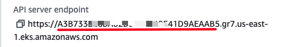

# EKS-ALB

Resources and configurations for deploying EKS with Application Load Balancer on AWS.

## Pre-requisites

- 01 VPC with:
  - 2 Public Subnets
    - Tags:
      - **kubernetes.io/role/elb : 1**
  - 2 Private Subnets
    - Tags:
      - **kubernetes.io/role/internal-elb : 1**
  - 1 Internet Gateways
  - 1 NAT Gateways
- 01 EKS Cluster created
- Create EKS-cluster role with policies - AmazonEKSClusterPolicy.
- Create EKS node group role with policies EC2 => AmazonEKSWorkerNodePolicy, AmazonEC2ContainerRegistryReadOnly, AmazonEKS_CNI_Policy.
- Change the following values in the loadbalancer-trust-policy.json file
  
  ```json
  <accountId>
  <oidcId>
  ```



## Implementation

1. Run script to create OIDC (OpenID Connect.)

    ```bash
    eksctl utils associate-iam-oidc-provider --region <region> --cluster <your-cluster-eks> --approve --profile <your-profile>
    ```

2. Run script to create the role that will be used by the service account

    ```aws
    aws iam create-policy --policy-name AWSLoadBalancerControllerIAMPolicy --policy-document file://loadbalancer-controller-policy.json --profile <your-profile>
    
    aws iam create-role --role-name LoadBalancerControllerRole --assume-role-policy-document file://loadbalancer-trust-policy.json --profile <your-profile>
    aws iam attach-role-policy --role-name LoadBalancerControllerRole --policy-arn <PolicyArn> --profile <your-profile>
    ```

3. Update the following values in the service-account.yaml file

    ```bash
    <accountid>
    <loadbalancerControllerRoleName>
    ```

    ```bash
    kubectl apply -f service-account.yaml
    kubectl get serviceaccount -n kube-system | grep load
    ```

4. helm install loadl balancer | Update cluster-name value

    ```console
    helm install aws-load-balancer-controller eks/aws-load-balancer-controller \
    -n kube-system \
    --set clusterName=<cluster-name> \
    --set serviceAccount.create=false \
    --set serviceAccount.name=aws-load-balancer-controller
    ```

5. Execute

    ```console
    kubectl apply -f deployment.yaml
    kubectl apply -f ingress.yaml
    ```
